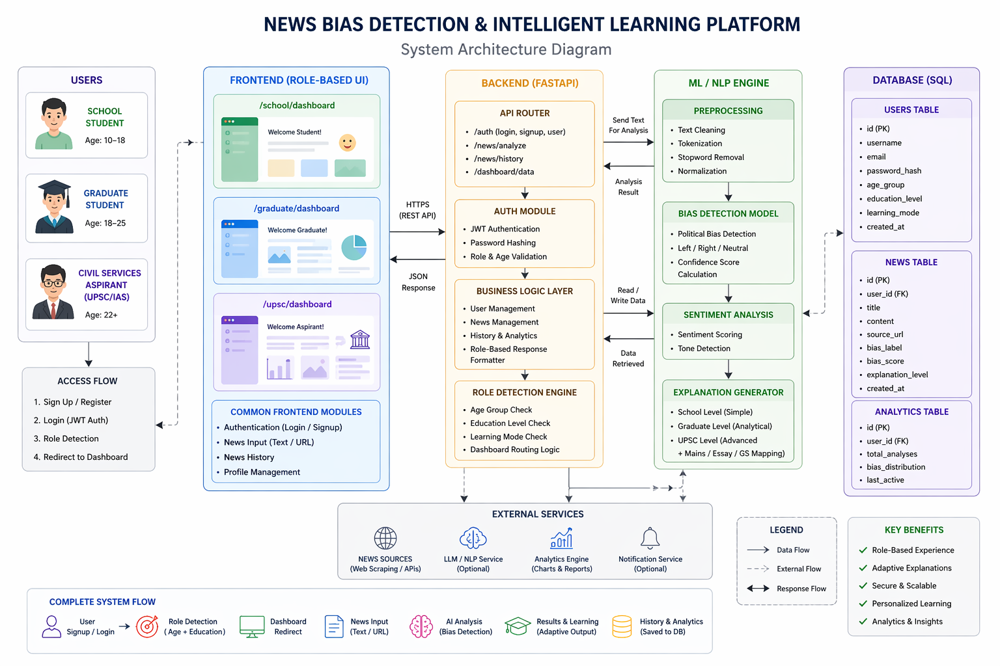

# Adaptive News Bias Detection & Educational Intelligence Platform


## The Elevator Pitch
The **Adaptive News Bias Detection Platform** is a multi-role educational intelligence system that dynamically scales its complexity based on the user's educational level. It analyzes news articles for political bias and generates tailored, age-appropriate explanations—ranging from simple emoji-based summaries for schoolchildren to full mains answer drafts for civil service aspirants.

## Visual Hook


## Core Modules

### 1. The Adaptive Bias Engine
A core analytical engine that ingests unstructured news text, identifies bias (Left/Center/Right), and extracts topic metadata. Crucially, it dynamically formats its output based on the user's cognitive and educational profile:
- **School Level:** Simplified vocabulary, visual emojis, and basic fact-checking.
- **Graduate Level:** Detailed pros/cons, historical context, and bias percentage scoring.
- **UPSC Level:** GS Paper mapping, policy implications, and structured essay/mains answer generation.

### 2. Role-Based Segregation System
A strict, modular frontend and backend architecture that explicitly segregates users. 
- Prevents cognitive overload by restricting users to their designated dashboard.
- Employs secure JWT-based routing to ensure strict data isolation.

## Technical Implementation

### Database Schema (SQLAlchemy)
The system utilizes a clean relational model to persist user states and analysis history.
- **`users` Table:** Stores authentication data, `age_group`, `education_level`, and dynamic JSON `interest_domain`.
- **`news_items` Table:** Logs analyzed articles, storing the `bias_score`, tailored `summary_text`, and specific `explanation_level`.

### API Architecture (FastAPI)
- **`/auth/*`**: Handles signup and login, issuing JWTs with embedded role claims.
- **`/dashboard-data`**: A polymorphic endpoint that returns vastly different JSON structures depending on the JWT's `education_level`.
- **`/news/analyze`**: The heavy-lifting endpoint that invokes the Bias Engine and formats the payload specifically for the requesting user's age group.
- **`/upsc/*`**: Dedicated endpoints strictly guarded for `civil_services` users.

### Modular UI Logic (Vanilla JS)
The frontend completely shuns SPAs in favor of decoupled, Vanilla JS modules (`school_dashboard.js`, `graduate_dashboard.js`, `upsc_dashboard.js`). Each module implements its own unique CSS system and API parsing logic, ensuring the "UPSC Prep Mode" is entirely disjoint from the playful "School Dashboard".

## Setup Instructions

### Prerequisites
- Python 3.9+
- Node.js (Optional, if transitioning back to React, but currently pure Vanilla JS)

### Backend Setup
1. Navigate to the backend directory:
   ```bash
   cd backend
   ```
2. Create and activate a virtual environment:
   ```bash
   python -m venv venv
   source venv/bin/activate  # On Windows: venv\Scripts\activate
   ```
3. Install dependencies:
   ```bash
   pip install -r requirements.txt
   ```
4. Start the FastAPI server:
   ```bash
   uvicorn main:app --reload
   ```

### Frontend Setup
1. The frontend operates on pure Vanilla JS and HTML.
2. Serve the `frontend_vanilla` directory using any static file server:
   ```bash
   python -m http.server 8080 -d frontend_vanilla
   ```
3. Open `http://localhost:8080` in your browser.

## Future Roadmap
- **LLM Integration:** Swap the keyword-based heuristic bias engine with a localized open-source LLM (e.g., LLaMA 3) for deeper nuance.
- **Gamification Tracking:** Expand the streak and points system to reward consistent, balanced reading habits.
- **Real-Time WebSockets:** Implement live collaborative debate rooms for Graduate-level users.
